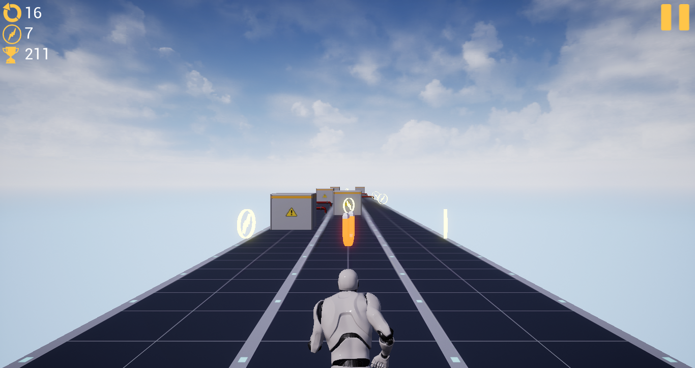
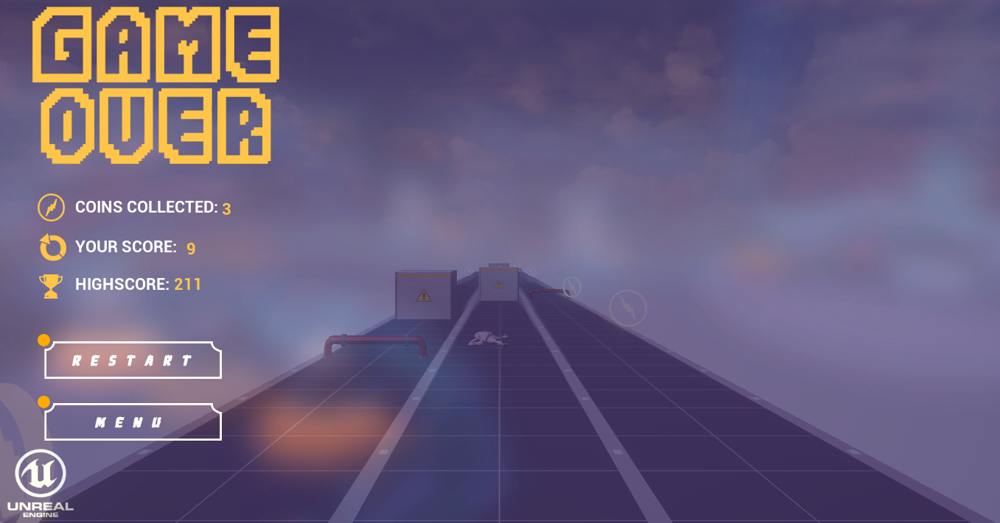

# Runner

An endless runner game made with Unreal Engine 4 using blueprints.
Features include obstacles, power-ups, sounds, simple animations, saving progress, high score, increasing game speed with time for difficulty, collision detection, pause & play, menus, HUD, unused object destruction.

## Screenshots

 
 
 

